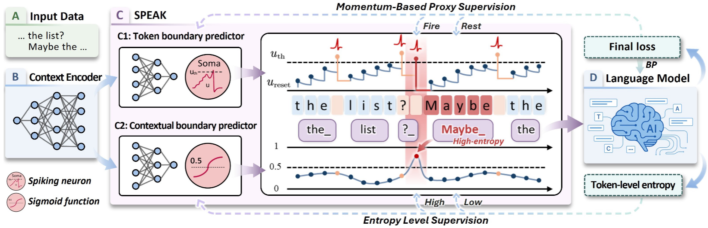

# SPEAK: Spiking Neurons as an Entropy-Aware Tokenizer for Large Language Models

Official implementation for the ACL ARR January 2026 submission.

## 1. Introduction

Tokenizers play a critical role in large language model studies. Despite recent advances, existing tokenizers fail to **explicitly leverage historical tokenization results** when making subsequent token decisions, nor do they **selectively utilize such history** based on contextual relevance.

We propose **SPEAK**, a tokenizer that integrates spiking neurons to explicitly leverage historical tokenization results. Furthermore, we introduce an **entropy-aware reset mechanism** that selectively leverages history based on contextual relevance, which is determined by token-level entropy:
- High-entropy tokens are treated as contextual boundaries where **hard reset** discards irrelevant historical tokenization results
- Low-entropy tokens between consecutive boundaries exhibit strong contextual relevance where **scaled soft reset** preserves and leverages relevant history

Experiments on 2 language models and 5 datasets spanning 16 languages demonstrate superior cross-lingual adaptability with competitive performance and efficiency.



## 2. Overview

### Core Methodology
SPEAK builds upon gradient-based tokenizers (GToks) with two key innovations:

1. **Spiking Neuron Integration**: A Leaky Integrate-and-Fire (LIF) neuron sequentially processes character embeddings, accumulating membrane potentials that explicitly encode historical tokenization decisions. Spikes (threshold crossings) determine token boundaries.

2. **Entropy-Aware Reset Mechanism**: 
   - Token-level generation entropy identifies contextual boundaries (high-entropy tokens) and contextual ranges (low-entropy tokens between boundaries)
   - Hard reset applied at contextual boundaries enforces linguistic isolation
   - Scaled soft reset (controlled by hyperparameter θ) applied within contextual ranges preserves partial history for linguistic continuity
   - A contextual boundary predictor is trained to identify reset positions using token-level entropy

3. **Optimization**: Due to the non-differentiable tokenization process, we employ momentum-based proxy supervision with Metropolis-Hastings sampling to optimize the tokenizer end-to-end via language model loss.

### Experimental Frameworks

This repository contains **two independent experimental frameworks**:

#### GTok Experiments (`GTok_Experiments/`)
- **Purpose**: Comparison against state-of-the-art gradient-based tokenizers (MAGNET, DTP)
- **Language Model**: Hourglass Transformer (lightweight model trained from scratch)
- **Datasets**: `text8` (en), `cc-100` (en), `wiki40b` (en, fi, he, vi)
- **Metrics**: Bits-per-character (BPC) ↓, Shortening factor (SF) ↑
- **Key Result**: Achieves new SOTA with average BPC of 1.108 and SF of 4.32× across 6 language settings

#### RTok Experiments (`RTok_Experiments/`)
- **Purpose**: Comparison against state-of-the-art rule-based tokenizers (DyTok, ZeTT)
- **Language Model**: XLM-R (base, 270M parameters) with LoRA fine-tuning and hypernetwork integration
- **Datasets**: 
  - XNLI (13 languages for natural language inference)
  - UNER (5 languages for named entity recognition)
- **Metrics**: Accuracy (XNLI) / F1-score (UNER) ↑, Token sequence length reduction ↑
- **Key Result**: Achieves 73.1% average accuracy on XNLI (+1.1% over DyTok) and 79.2% F1 on UNER (+1.1% over ZeTT), with 5.3%–13.4% efficiency gains

## 4. Environment Setup

```bash
# Create and activate conda environment
conda create -n speak python=3.11
conda activate speak

# Install dependencies
pip install -r requirements.txt
```

## 5. Running Experiments

### GTok Experiments

```bash
cd GTok_Experiments
python main.py
```


### GTok Experiments

```bash
cd GTok_Experiments
python main.py
```

All experimental configurations (datasets, hyperparameters, reset modes, etc.) are defined within the respective main.py files. Modify the configuration section in each main.py according to your experimental requirements.